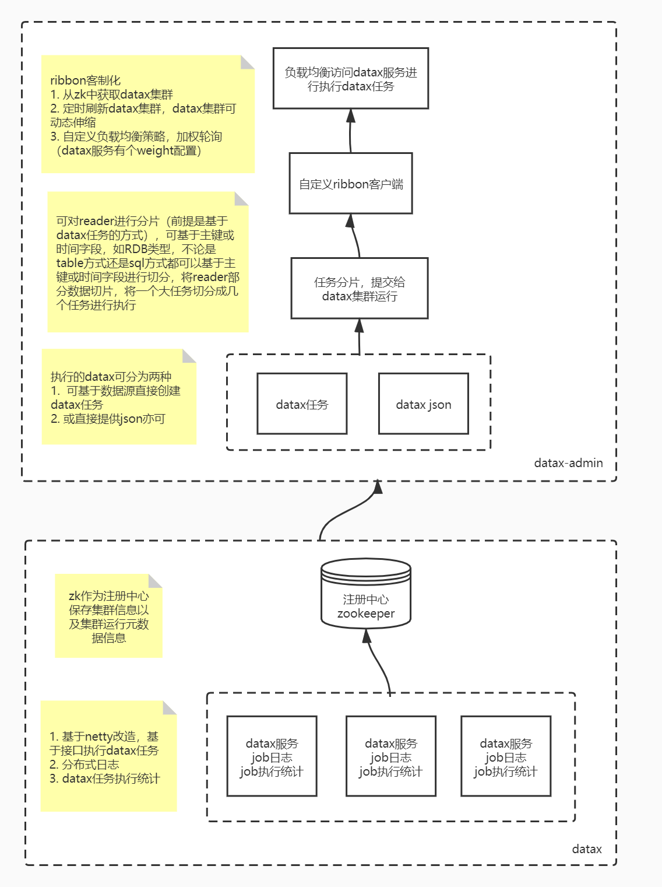
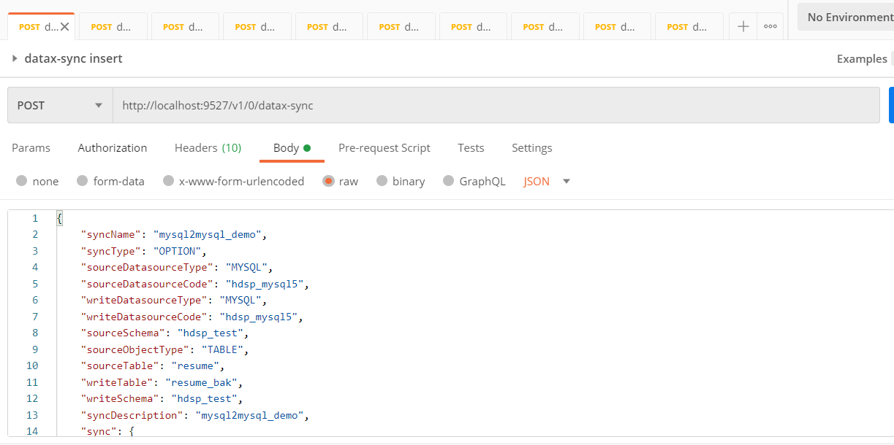
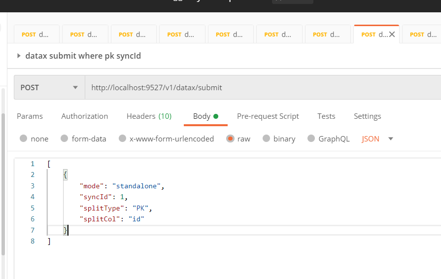
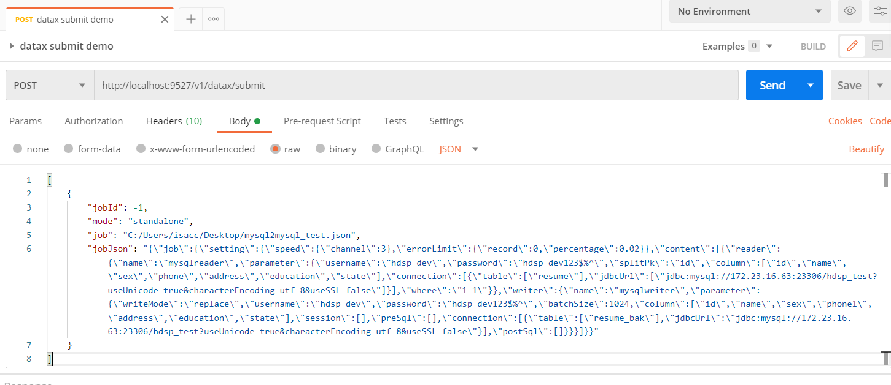

# datax-admin

该项目[二开DataX](https://github.com/thestyleofme/DataX.git) 实现DataX集群，为了方便使用，故开发了datax-admin服务统一管理。

DataX分布式集群与负载均衡、任务执行/统计，基于DataX的通用数据同步微服务，一个Restful接口搞定所有通用数据同步

- **DataX分布式集群负载均衡**
- **Datax集群动态可伸缩**
- **支持http方式提交DataX任务到集群运行**
- **统计DataX执行信息以及本次执行脏数据**
- **DataX分布式日志**
- **DataX对源端分片执行，提高同步效率**
- **基于多数据源自带接口可创表查表结构等接口，可快速开发web页面创建Datax任务**
- **Datax任务管理，jobId全局唯一**
- **Datax任务敏感信息脱敏，如密码**

了解二开DataX详情，请移步[DataX](https://github.com/thestyleofme/DataX.git)

## Get Started

> 架构了解



按照说明文档[DataX](https://github.com/thestyleofme/DataX/blob/master/datax-cluster.md) 启动DataX集群即可。

该项目需要[动态数据源(数据中台多数据源统一接口)](https://github.com/thestyleofme/plugin-driver-parent.git) 支持，可clone下来，按照说明文档进行打包，
放到此项目dist/plugin目录（配置文件可配置）下，即${your_path}/data-audit-parent/dist/plugins/driver-xxx.jar

## Introduction

### 1. 创建datax任务

可以基于数据源定制化web页面进行创建datax任务，后台接口请求示例


主要关注sync里面的reader，writer，setting，对应datax原生的reader，writer，setting，其余配置信息主要是reader和writer的数据源信息
> POST http://localhost:9527/v1/0/datax-sync
```
{
    "syncName": "mysql2mysql_demo",
    "syncType": "OPTION",
    "sourceDatasourceType": "MYSQL",
    "sourceDatasourceCode": "hdsp_mysql5",
    "writeDatasourceType": "MYSQL",
    "writeDatasourceCode": "hdsp_mysql5",
    "sourceSchema": "hdsp_test",
    "sourceObjectType": "TABLE",
    "sourceTable": "resume",
    "writeTable": "resume_bak",
    "writeSchema": "hdsp_test",
    "syncDescription": "mysql2mysql_demo",
    "sync": {
        "reader": {
            "username": "hdsp_dev",
            "connection": [
                {
                    "table": [
                        "resume"
                    ],
                    "jdbcUrl": [
                        "jdbc:mysql://172.23.16.63:23306/hdsp_test?useUnicode=true&characterEncoding=utf-8&useSSL=false"
                    ]
                }
            ],
            "schema": "hdsp_test",
            "column": [
                "id",
                "name",
                "sex",
                "phone",
                "address",
                "education",
                "state"
            ],
            "where": "",
            "splitPk": "id"
        },
        "writer": {
            "username": "hdsp_dev",
            "connection": [
                {
                    "table": [
                        "resume_bak"
                    ],
                    "jdbcUrl": "jdbc:mysql://172.23.16.63:23306/hdsp_test?useUnicode=true&characterEncoding=utf-8&useSSL=false"
                }
            ],
            "schema": "hdsp_test",
            "column": [
                "id",
                "name",
                "sex",
                "phone1",
                "address",
                "education",
                "state"
            ],
            "preSql": [
                ""
            ],
            "postSql": [
                ""
            ],
            "writeMode": "insert",
            "batchSize": 1024
        },
        "setting": {
            "speed": {
                "channel": 1
            },
            "errorLimit": {
                "percentage": 0,
                "record": 0
            }
        }
    }
}
```
### 2. 执行datax任务

> 基于上述创建的datax job去执行，可做分片



body是传一个json数组，可批量提交多个datax job，示例

```json
[
    {
        "syncId": 1,
        "splitType": "PK",
        "splitCol": "id"
    }
]
```

还可以设置对reader分片
* splitType，分片方式，可按主键或时间，取值[PK/DATE]，为空即不做分片
* splitCol，按哪个字段去分片，PK的话即是主键字段，DATE的话即使日期的字段，splitType不为空时，该字段必传

> 直接基于json执行，不能分片

分片的前提是必须有syncId，即存在一个datax job，故这种方式是不能分片的。



```json
[
    {
        "job": "C:/Users/isaac/Desktop/mysql2mysql_test.json",
        "jobJson": "{\"job\":{\"setting\":{\"speed\":{\"channel\":3},\"errorLimit\":{\"record\":0,\"percentage\":0.02}},\"content\":[{\"reader\":{\"name\":\"mysqlreader\",\"parameter\":{\"username\":\"hdsp_dev\",\"password\":\"hdsp_dev123$%^\",\"splitPk\":\"id\",\"column\":[\"id\",\"name\",\"sex\",\"phone\",\"address\",\"education\",\"state\"],\"connection\":[{\"table\":[\"resume\"],\"jdbcUrl\":[\"jdbc:mysql://172.23.16.63:23306/hdsp_test?useUnicode=true&characterEncoding=utf-8&useSSL=false\"]}],\"where\":\"1=1\"}},\"writer\":{\"name\":\"mysqlwriter\",\"parameter\":{\"writeMode\":\"replace\",\"username\":\"hdsp_dev\",\"password\":\"hdsp_dev123$%^\",\"batchSize\":1024,\"column\":[\"id\",\"name\",\"sex\",\"phone1\",\"address\",\"education\",\"state\"],\"session\":[],\"preSql\":[],\"connection\":[{\"table\":[\"resume_bak\"],\"jdbcUrl\":\"jdbc:mysql://172.23.16.63:23306/hdsp_test?useUnicode=true&characterEncoding=utf-8&useSSL=false\"}],\"postSql\":[]}}}]}}"
    }
]
```
body
* job，datax的json路径，不推荐使用，考虑集群原因，负载的机器可能不存在该文件
* jobJson，datax json信息，优先级最高，当job和jobJson同时存在时，取jobJson


